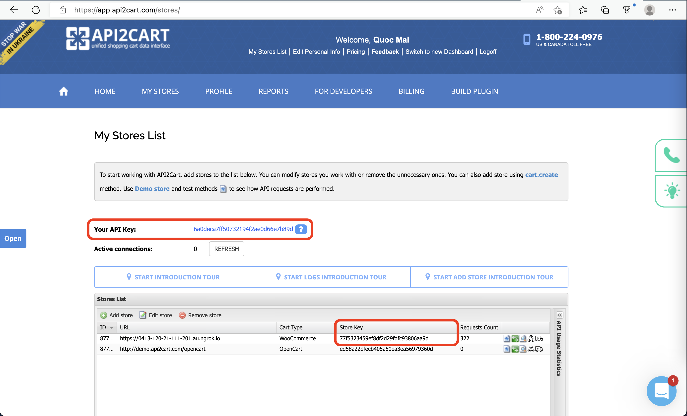
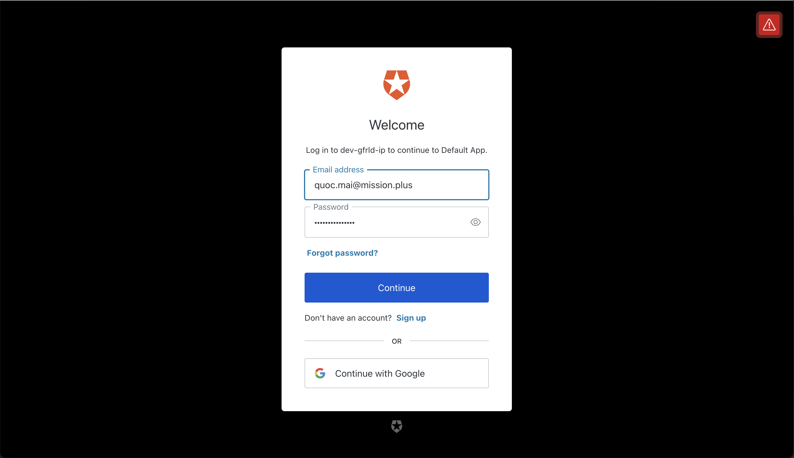
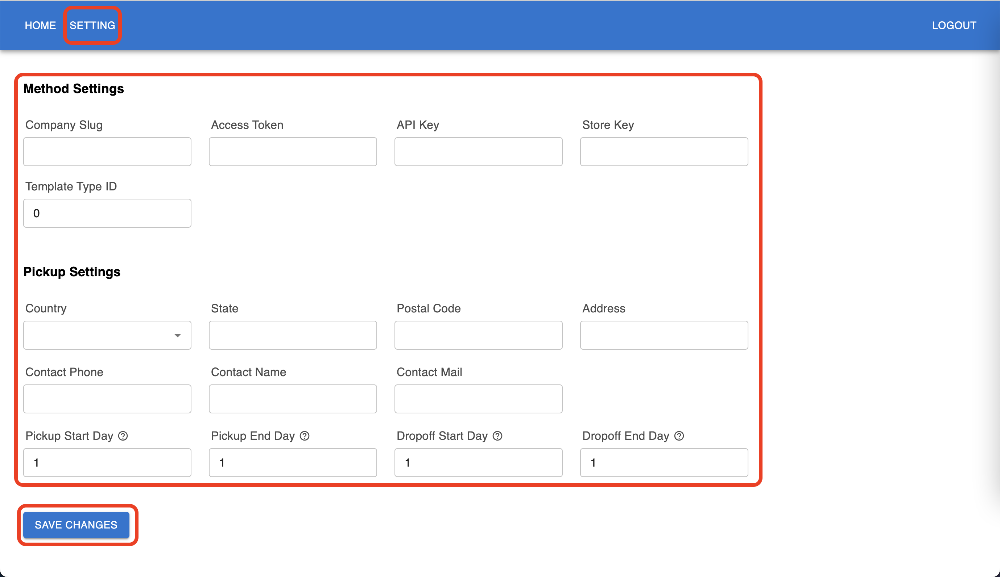
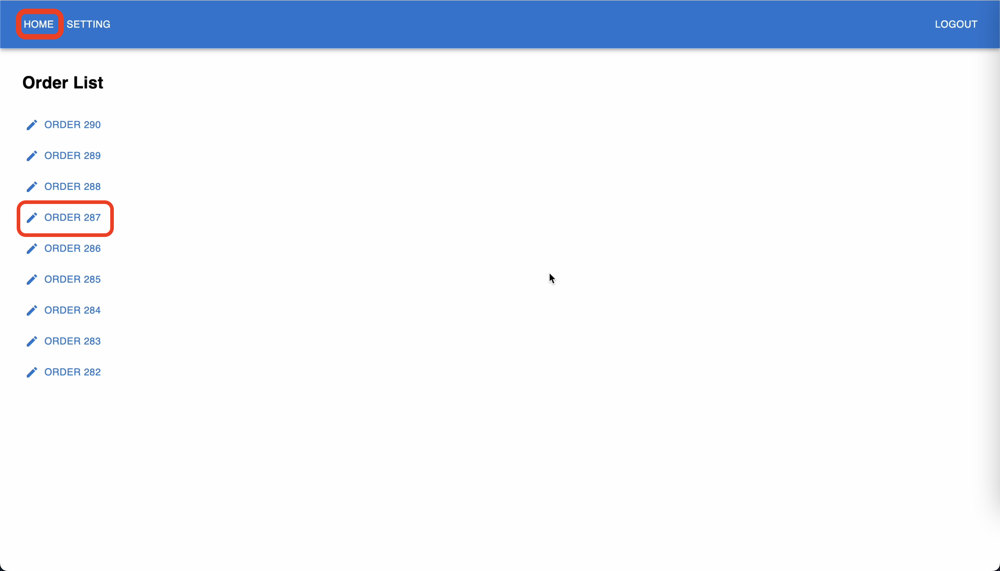
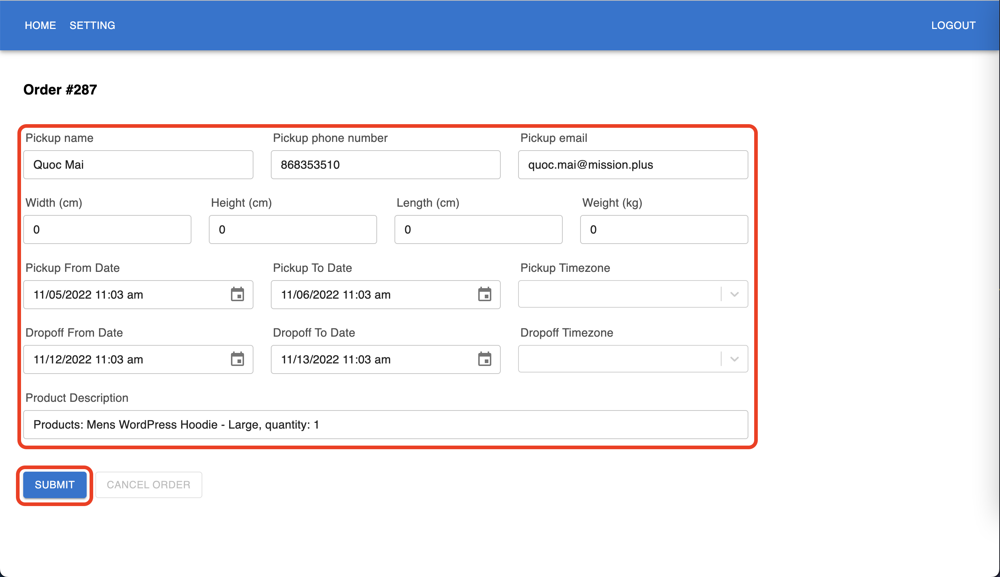
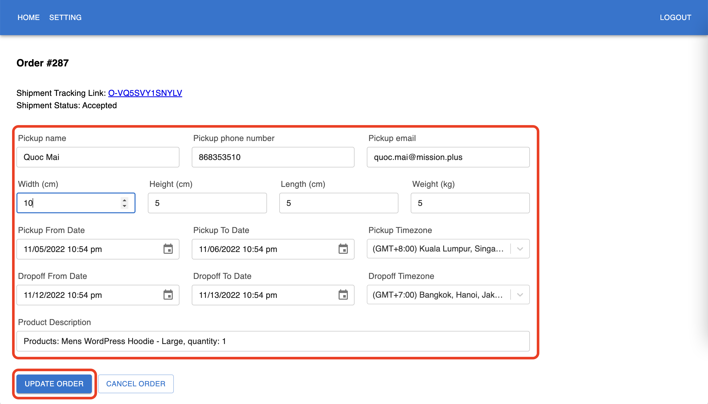
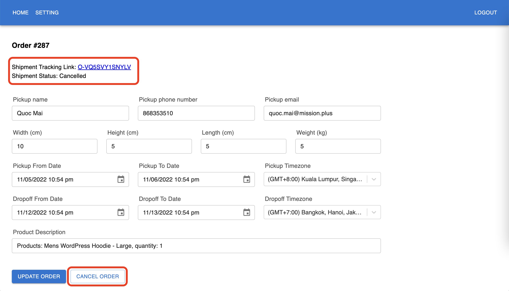

<!-- PROJECT LOGO -->
 

  
<h3 align="center">Yojee Plugin Guidance</h3>

## How to use Api2Cart integration

### Step 1: Create an [Api2Cart account](https://app.api2cart.com/)

### Step 2: Follow this [Api2Cart guide](https://docs.api2cart.com/post/how-to-start-your-integration-with-api2cart#:~:text=1.%20How%20to%20start%20your%20work%20with%20API2Cart) to set up a store connection and retrieve the API and Store keys.

### Step 3: Go to Api2Cart integration page. Then sign up for a new account and log in.

### Step 4: Go to Setting, fill in all required fields and click "Save changes"

### Step 5: Go to Home and click on an order to view order details

### Step 6: Fill in all shipping information and click Submit to create a new Yojee order

### Step 7: After a shipment is submitted, it can be edited by changing the shipping information and clicking Update

### Step 8: A shipment can also be canceled by clicking Cancel order
