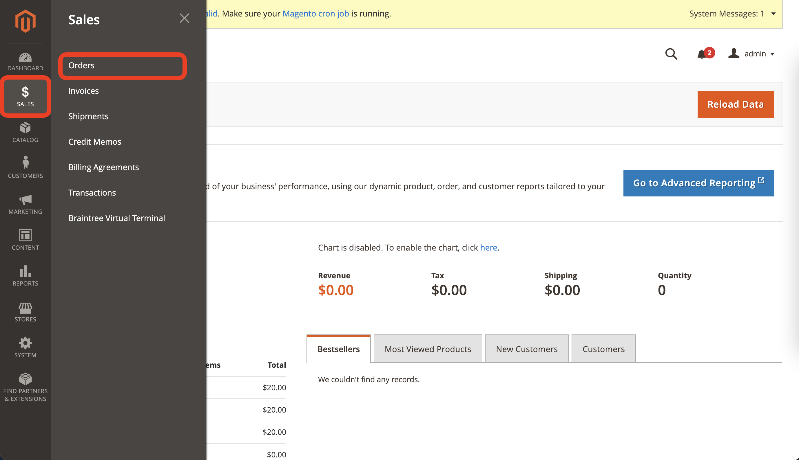

<!-- PROJECT LOGO -->
 

  
<h3 align="center">Magento Extension Guidance</h3>

## How to install Yojee Magento Extension

### Step 1: Install Yojee extension from [Magento Marketplace](https://marketplace.magento.com/)

### Step 2: Log in into the Shopify Admin Page

### Step 3: Go to Store > Configuration

### Step 4: Go to Sales > Delivery Methods

### Step 5: Select Yojee Shipping and fill in all setting fields

## How to use Yojee Magento Extension

### Step 1: When an order is placed, go to Sales > Orders

### Step 2: Click View to view the order

### Step 3: Go to Ship tab

### Step 4: Fill in shipment details and click Submit Shipment

### Step 5: After a shipment is submitted, it can be edited by going to Shipments tab and click View on the existing shipment

### Step 6: Edit shipment details and click Edit
