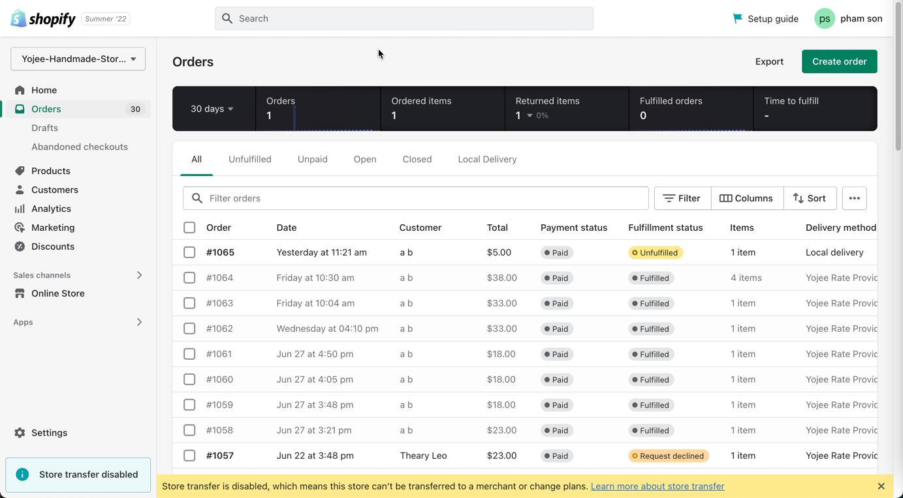
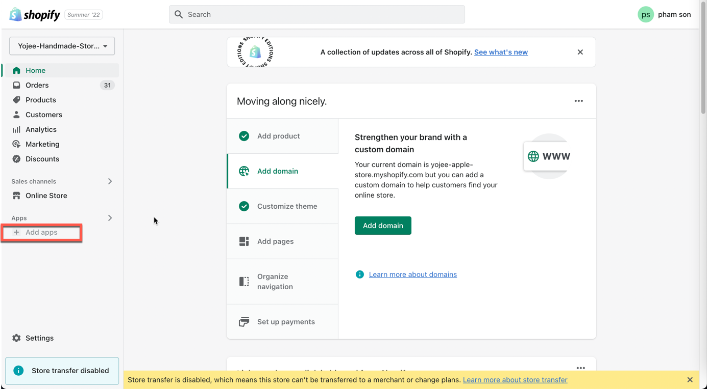
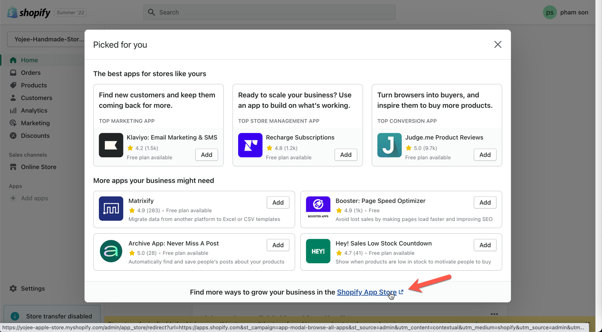
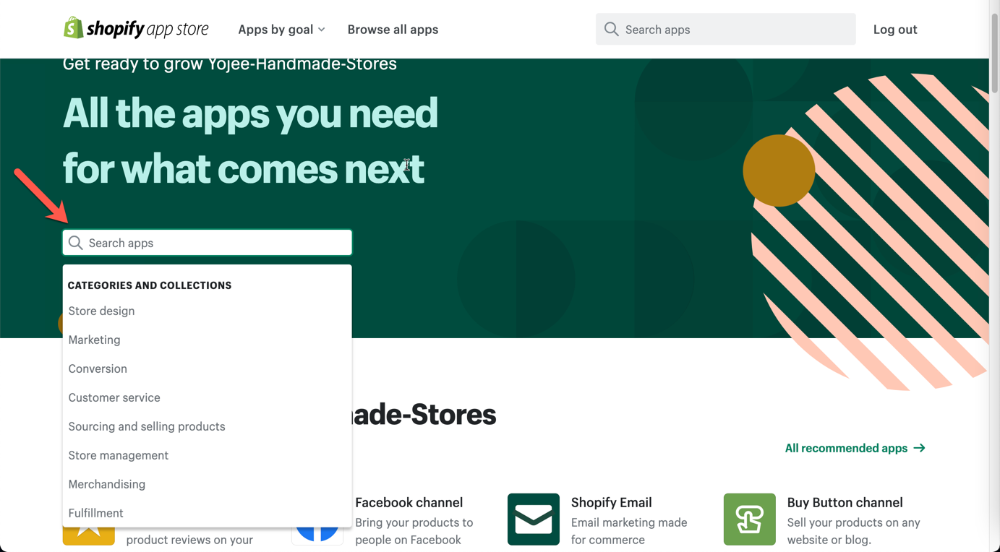
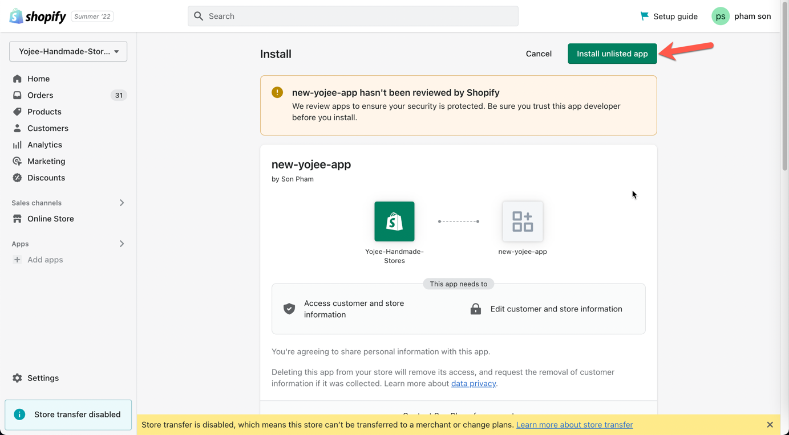
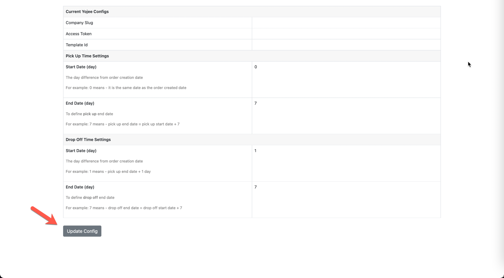
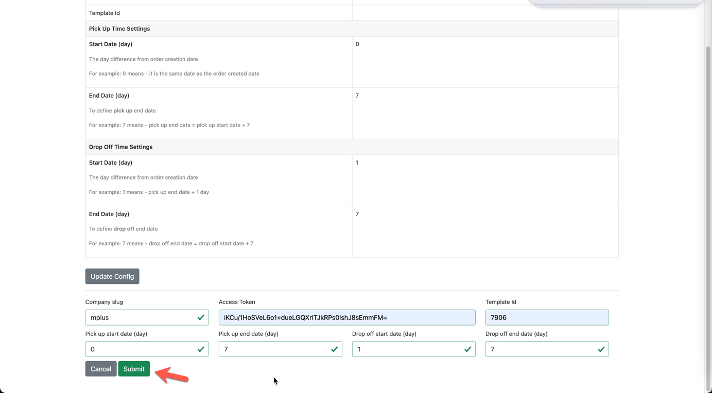
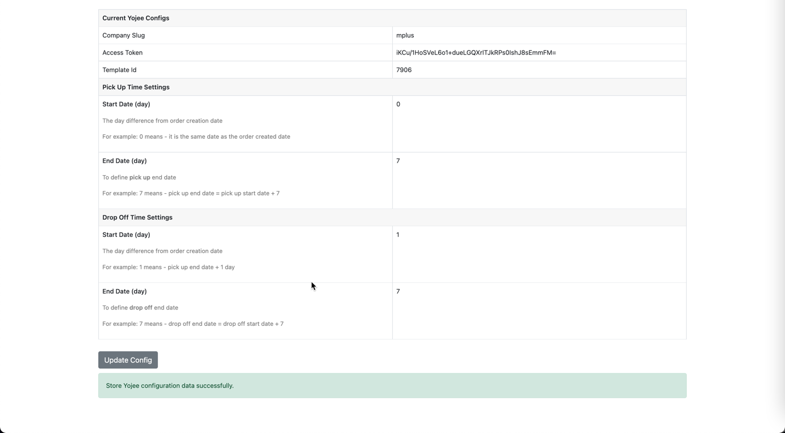
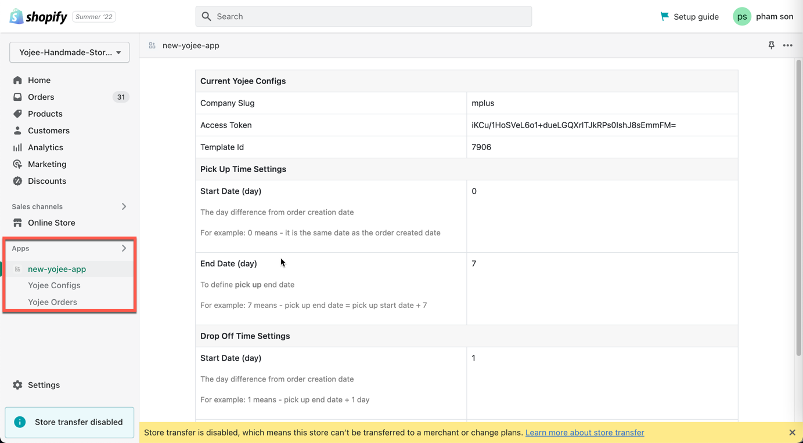

<!-- PROJECT LOGO -->
 

  
<h3 align="center">Shopify Plugin Guidance</h3>

<!-- PLUGIN OVERVIEW -->
## Plugin Overview

Yojee Shopify plugin helps Shopify sellers to manage their orders through Yojee System.

There are following main features in this plugin:
* Installing the app via Shopify Marketplace
* Allow sellers to update their Yojee credentials (company_slug, access_token, sender_id)
* Fulfill orders by using Yojee System
* Tracking order real time, printing shipping label, sending tracking url and order status to customer
* Preview Order and provide updating some order dimensions (width, height, length) and weight

## How to install Yojee Shopify Plugin

### Step 1: Log in into the Shopify Admin Page

### Step 2: Click on "Add app" button and then click on "Shopify App Store"

### Step 3: In the Shopify App Store page, click on "Search apps" bar

### Step 4: Type "Yojee" to search for Yojee Integration App and then select from the result
(Upload content here when our app is available in Shopify App Store)

### Step 5: Click on "Add app" button

### Step 6: Click on "Install app" button
(The button label will be "Install app" once our app is available in Shopify App Store)

### Step 7: Click on "Update Config" button to enter Yojee Integration Credential Config

### Step 8: Update company slug, access token, template id, pickup and dropoff date config  and click on "Submit"

### Step 9: You have finished setting up the config. Close the page, back to admin page, and you should see Yojee Integration App.

