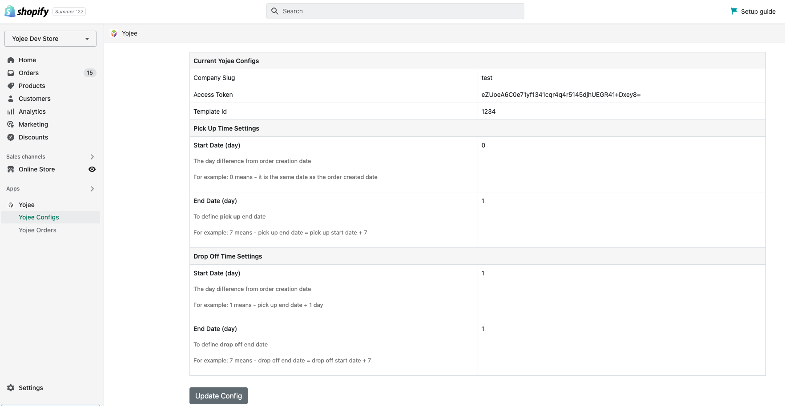

<!-- PROJECT LOGO -->
 

  
<h3 align="center">Shopify - Yojee Setup Guide</h3>

<!-- PLUGIN OVERVIEW -->

## How it works

1. From your Shopify admin portal, download the Yojee app.
2. Yojee will prompt for information to connect the Yojee dispatcher platform to your Shopify account.
3. Upon successful configuration, you will be able to send every delivery order to the Yojee dispatcher platform for order fulfillment.

## How to install Yojee app

### Step 1: Login into the Shopify Admin Page.

### Step 2: Option 1

#### a. Click on "Add app" button and then click on "Shopify App Store".

#### b. In the Shopify App Store page, click on "Search apps" bar. Type "yojee" to search for Yojee app.

### Step 2: Option 2

#### a. Click on the "Search" bar on top of the page and click on "Apps" icon. Once it is selected, type "yojee" in the search bar and hit enter.

### Step 3: Click on the result as shown below.

### Step 4: Click on "Add app" button.

### Step 5: Click on "Install app" button.

### Step 6: Click on "Update Config" button to enter Yojee Integration Credentials Config.

### Step 7: Update company slug, access token, template id, pickup and dropoff date config and click on "Submit" button to save those information.

### Step 8: You have finished setting up the config. Close the page and go back to admin page, you should be able to Yojee App on the left panel.

