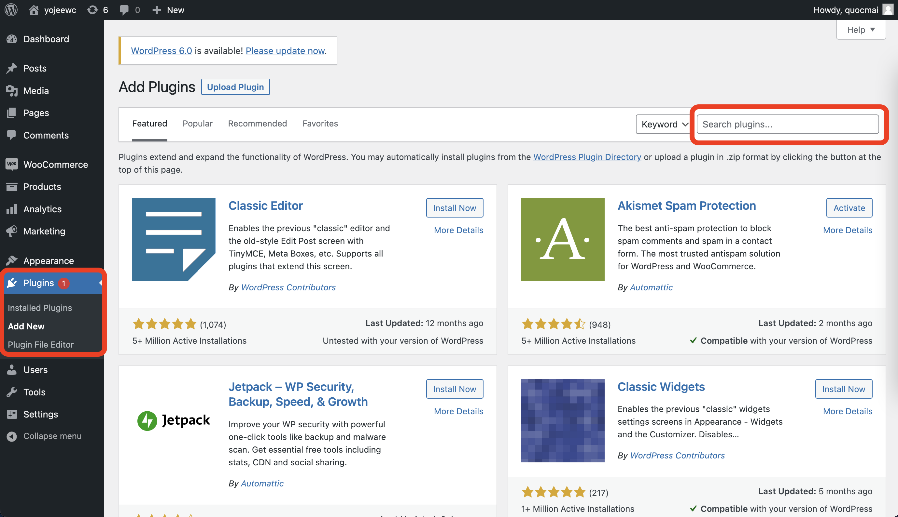
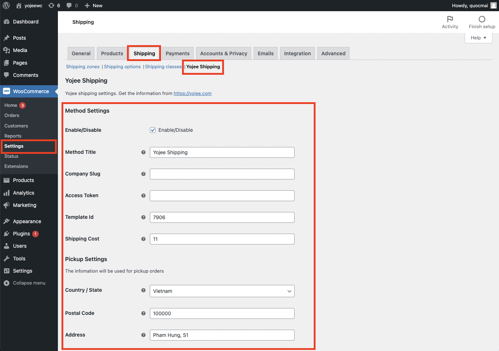
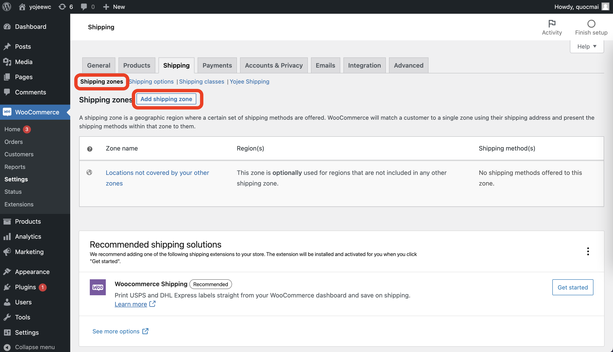
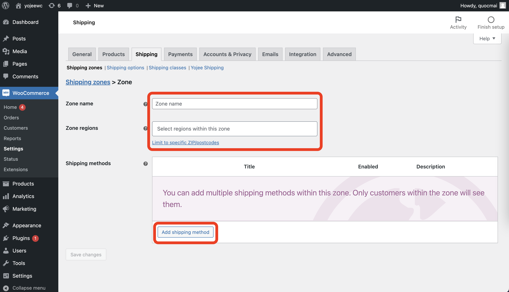
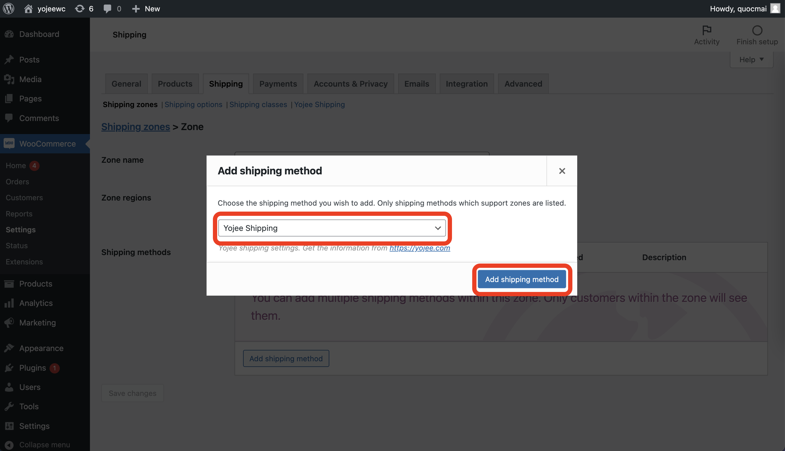
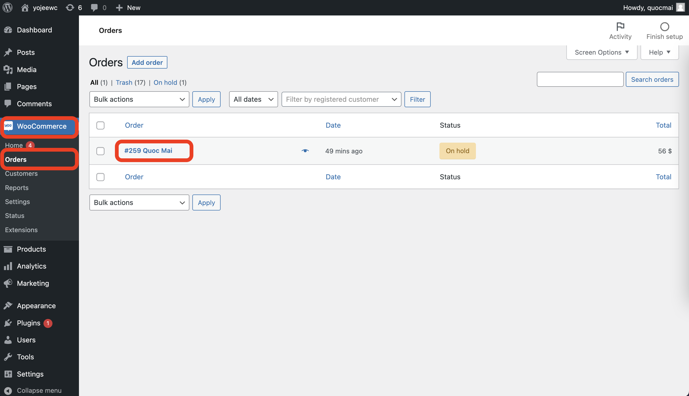
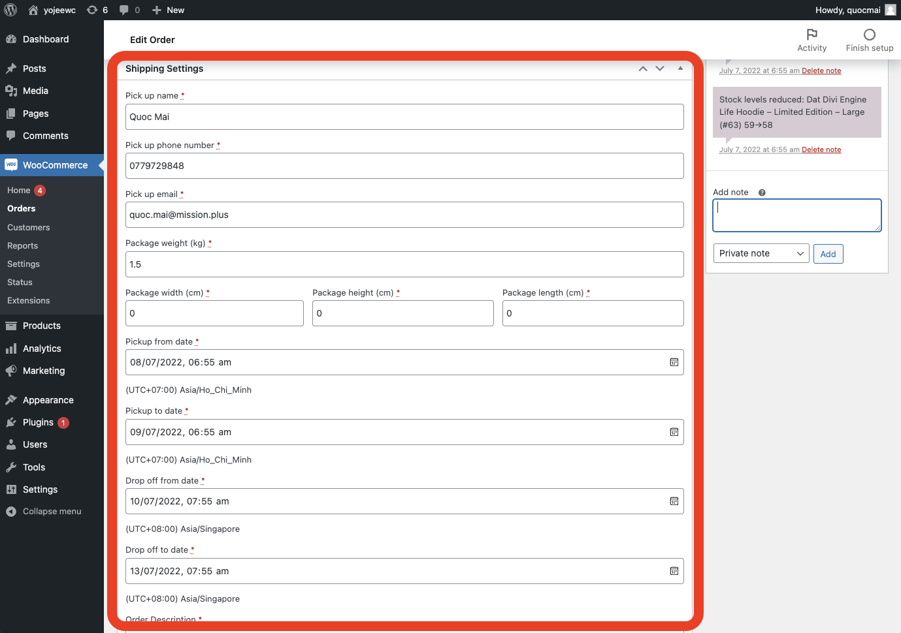
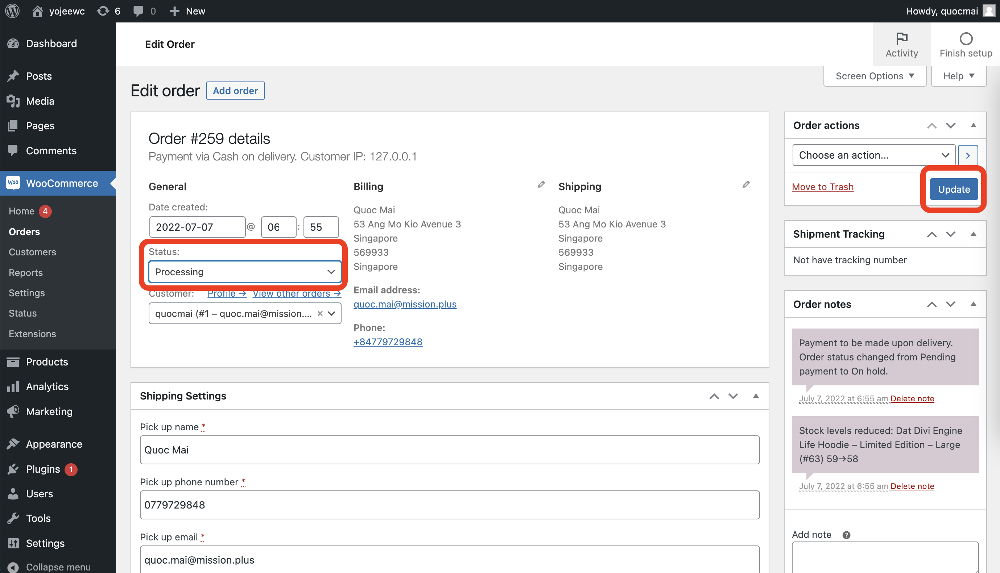
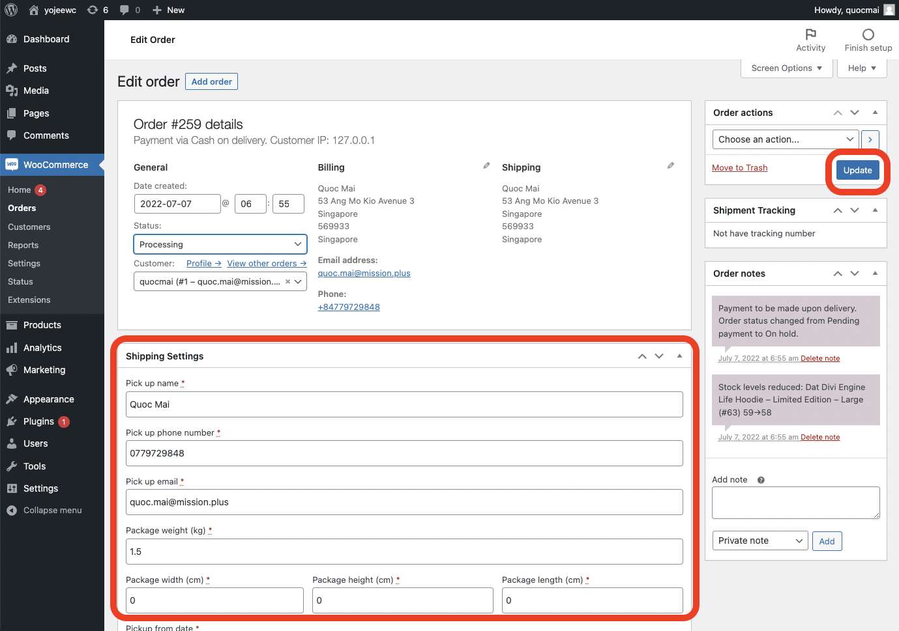

<!-- PROJECT LOGO -->
 

  
<h3 align="center">Yojee Plugin Guidance</h3>

## How to install Yojee Woocommerce Plugin

### Step 1: Log in into the Woocommerce Admin Page

### Step 2: Install Yojee plugin from the marketplace

### Step 3: Go to Woocommerce > Setting > Shipping > Yojee Shipping and fill in all setting fields

### Step 4: Go to Shipping Zones and click Add shipping zones

### Step 5: Fill in zone's information and click Add shipping method

### Step 6: Choose Yojee Shipping from the list and Add shipping method

## How to use Yojee woocommerce Extension

### Step 1: When an order is placed, go to Woocommerce > Orders and click on the order

### Step 2: Fill in shipment details

### Step 3: Change Status to Processing and click Update

### Step 4: After a shipment is submitted, it can be edited by changing the Shipping Settings and click Update
