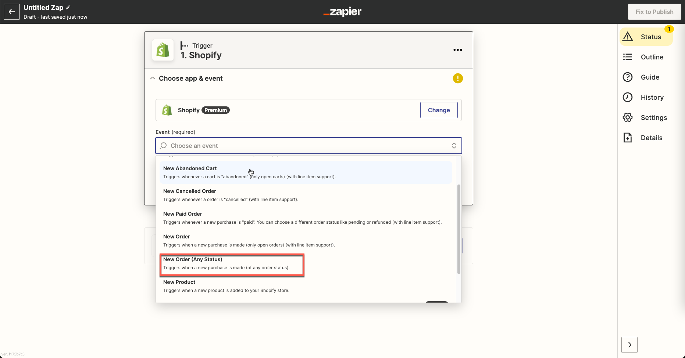
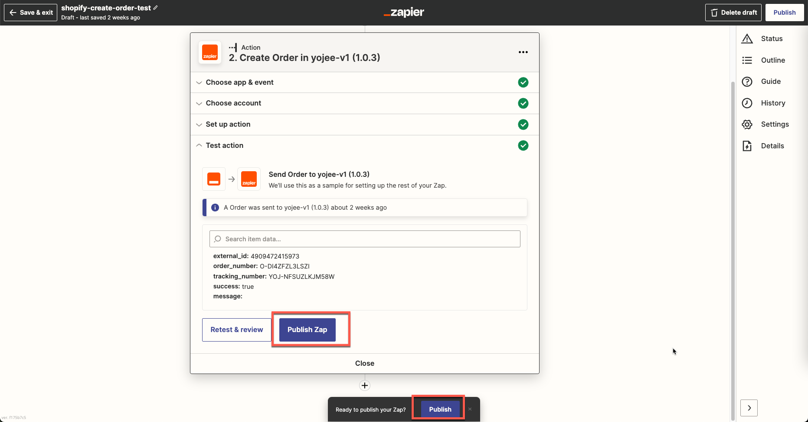

<div id="top"></div>
<!-- PROJECT LOGO -->
<br />
<div align="center">
  <a href="https://yojee.com/">
    
  </a>
<h3 align="center">Zapier Plugin Guidance</h3>
</div>

<!-- PLUGIN OVERVIEW -->

## Plugin Overview

Yojee Zapier plugin helps Zapier sellers to use import orders from any system to Yojee. Those system can be from Shopify, Magento or WooComerce stores

There are following main features in this plugin:

- Search and add the app via Zapier Marketplace
- Allow Zapier user to update their Yojee credentials (company_slug, access_token, template_type_id)
- Mapping orders properties from other system to Yojee Order
- Import orders automatically to Yojee system when an order events are triggered, i.e: Create Order, Cancel Order
- Tracing log, view log, testing plugin in real time

## How to install Yojee Zapier Plugin

### Step 1: Log in into the Zapier Admin Page and click on "Create Zap" button to create a Zap


### Step 2: Search an application from the list to import orders to Zapier. i.e: Shopify stores


### Step 3: Add event type for this action.

(If you want to any order created from Shopify, it will import to Yojee. Please choose "Create Order" event)
Click to Continue Button



### Step 4: Connect with your Shopify store then click on Continue


### Step 5: You can click on "Test Trigger" button to test trigger

(The button label will be "Install app" once our app is available in Shopify App Store)


### Step 6: Add new action steps, search for Yojee app from the list.

(Note: When the Yojee app is published, we can search from the list, otherwise you have to be invited to use Yojee app)


### Step 7: Choose Yojee create event action. i.e: Create new order. Then click continue

(Note: If you choose "Cancel Order" Shopify event in the previous step, then you must choose Cancel Order Yojee event in this step)


### Step 8: Add Yojee Credential in this step. Provide 3 informations (company_slug, access_token, template_type_id)


### Step 9: Setup mapping create order action and click on Continue


### Step 10: You can review and test the mapping before publishing your Zap


If the setup is successfully, you can see the message:

```
external_id: 4909472415973
order_number:O-DI4ZFZL3LSZI
tracking_number: YOJ-NFSUZLKJM58W
success:true
message:
```

Otherwise you can see the error message

### Step 11: Click on "Publish" to publish your Zap.

After you publish your Zap, it will automatically import the order from Shopify to Yojee if there is a new order created from your Shopify store


